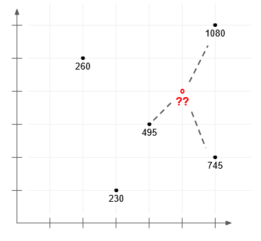

# HW4 - Exceptions and Testing

You will implement the k-nearest neighbors algorithm for regression, along with appropriate exceptions and tests. K-nearest neighbors regression is a useful tool in machine learning.

We suggest that you commit your partial code after Step 2 and Step 3 in addition to after Step 4. This is an opportunity to checkpoint your work and practice test-driven development.

### 1. Create the directories.

Create two directories at the base directory of the homework repository: `knn` and `tests` [1pt].

### 2. Create a module in the `knn` folder named `knn.py`.

Inside `knn.py`, write a function interface, `knn_regression(n_neighbors, data, query)` for a function that implements the k-nearest neighbors algorithm for regression. (1pt)

At this time, write ONLY the interface. We are practicing test-driven development - write the interface first, then proceed to the next step, without any implementation. To make your code valid, you should return a dummy value or throw an exception, but you do not do a real computation until after you have written tests.

The function takes 3 parameters:
1. Parameter `k`, or `n_neighbors`. `n_neighbors` must be an integer and must be greater than 0.
2. `data` - 2 dimensional numpy array of shape (m, **n+1**)). `m` denotes the number of samples and `n` is the number of variables in each sample. `+1` is for the labels in each sample - the last column in the sample. `m` must be at least as large as `n_neighbors`. `n` must be at least 1 (so the 2-dimensional array must be *at least* (m, 2)). All samples must have the same value of `n`. All samples and labels must be numeric.
3. `query` - 1 dimensional numpy array, shape (n,). `n` must be the same as in the `data` argument.

The algorithm returns the predicted label for query (a single numeric value) or raises an appropriate exception (such as `ValueError`) when inappropriate inputs are passed for any argument (wrong type, wrong shape, or wrong value).

#### Example inputs and outputs

```
import numpy as np

n_neighbors = 3
data = np.array([[3, 1, 230],
                 [6, 2, 745],
                 [6, 6, 1080],
                 [4, 3, 495],
                 [2, 5, 260]])

query = np.array([5, 4])

knn_regression(n_neighbors, data, query)  # returns 773.33
```

This is a visualization of the example inputs.



### 3. Create a Python module `test_knn.py` inside the `tests` folder.

Inside `test_knn.py`, write a series of test cases to confirm the validity of your implementation in `Step 2`, using the `unittest` framework (1pt). 

At the end of this step, most of your tests should be **failing** because you haven't written the implementation of the function yet!

These tests should contain:

a. At least one *smoke* test (1pt).

b. At least two *one-shot* tests (2pt).

c. All appropriate *edge* tests you find useful for the algorithm (at least four) (2 pts).

Use a `__main__` block to run the tests (1pt).

Note that the creation of data to test your function is up to you. Other than the example above, we do not provide a dataset.

### 4. Implement `knn_regression` to calculate the k-nearest neighbors algorithm.

(2 pts for algorithm, 1 pt for exceptions)

We are not grading your homework based on computational complexity or on dimensionality larger than 4, so don't worry about inefficient algorithms. You may NOT use an existing library to do your k-nearest-neighbors calculation automatically.

At the end of this step, if you rerun the tests, your tests should now be passing.

#### Pseudocode for kNN Regression

```
A. For each example in the data:

    A.1 Calculate the distance between the query example and the current example from the data
    
    A.2 Add the distance and the index of the example to an ordered collection

B. Sort the ordered collection of distances and indices from smallest to largest (in ascending order) by the distances

C. Pick the first K entries from the sorted collection

D. Get the labels of the selected K entries

E. Return the mean of the K labels
```
